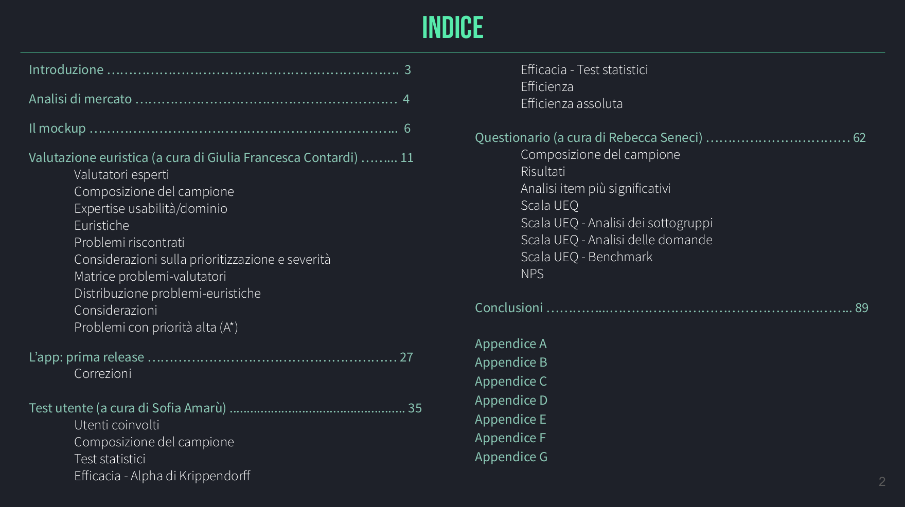

# Progetto di Interazione Uomo-Macchina

Valutazione longitudinale di usabilità dell’applicazione Movyes, a cura di [Sofia Amarù](https://github.com/amarusofia), [Giulia Francesca Contardi](https://github.com/giuliaContardi) e Rebecca Seneci. 

È stata condotta una valutazione euristica sul mockup dell'applicazione per individuarne eventuali prblemi. Sono stati effettuati alcuni test statistici su valutatori comuni, al fine di valutare l’efficacia e l’efficienza del sistema in esame nella sua fase di modellazione (mockup) e a rilascio avvenuto (applicazione). È stato infine sottoposto agli utenti l'User Experience Questionnaire per valutare l’indice di gradimento e la positività o negatività dell’esperienza d’uso di Movyes.

Il progetto può essere scaricato cliccando [qui](https://github.com/amarusofia/Progetto-Interazione-Uomo-Macchina/raw/main/Progetto%20Interazione%20Uomo-Macchina.pdf).
